# Smart Context

**Feed large language models better inputs, faster.** **Smart Context *collects, cleans, and copies* every note you need** in a single click.

> [!NOTE] Why does context matter?
> AI only answers as well as the context you provide. Smart Context helps aggregate scattered notes into templated snippets that can be quickly pasted into ChatGPT, so your prompts hit harder, your responses feel clairvoyant, and your flow state stays unbroken.

✔️ Zero-setup: works out-of-the-box
🔐 Local-first and privacy-preserving
🤖 Compatible with any AI workflow
⚔️ Mission-driven, community-supported

---

## Mission-driven

The Obsidian community proved user-aligned software can out-innovate closed platforms. Smart Context embodies that spirit—open-source tools that **empower individuals**, not gatekeepers. Read about the [Smart Principles](https://smartconnections.app/smart-principles/) that guide development.

## Private by Design

No data leaves your vault unless *you* copy it. All parsing, filtering, and token estimates run locally. Use local embedding models or remote APIs—it is your choice.

---

## Getting Started

### Easy installation

* Open **Settings -> Community plugins -> Browse**
* Search for **Smart Context** and select **Install**
* Click **Enable** to activate the plugin

[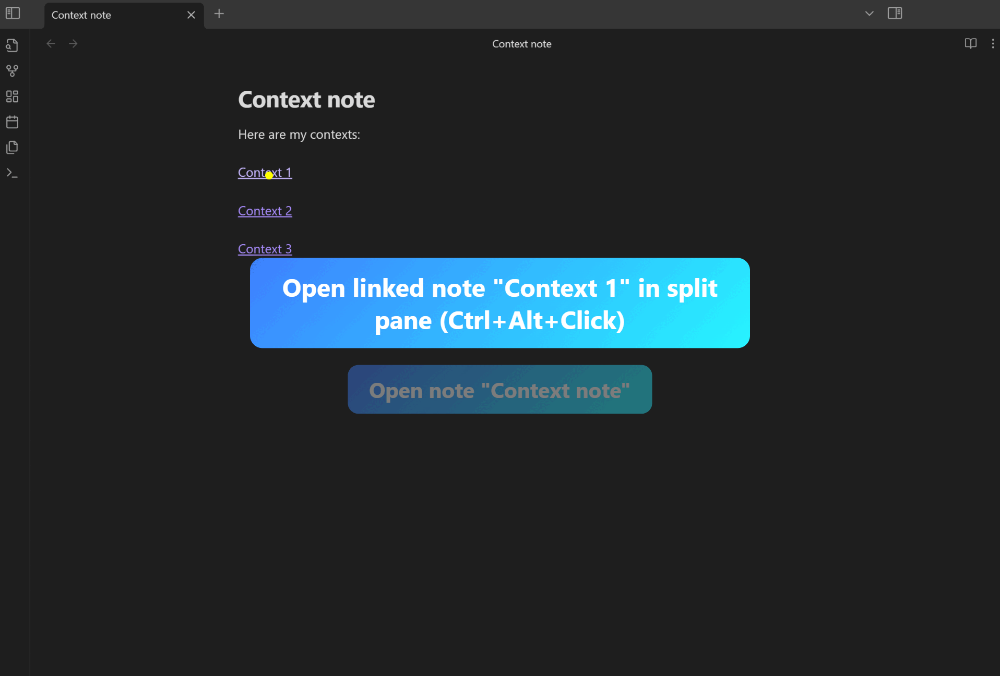](https://docs.smartconnections.app/Smart-Context/Getting-Started)

Read the [Getting Started guide](https://docs.smartconnections.app/Smart-Context/Getting-Started) for a step-by-step walkthrough.

### Your first clipboard export

Copy an entire folder without touching your mouse.

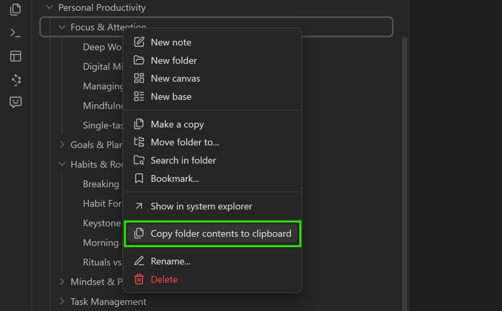

* Right-click the folder, choose **Copy contents to clipboard**
* Paste straight into ChatGPT, Claude, Gemini, or any model
* Enjoy richer answers with zero manual clean-up

Prefer the command palette?

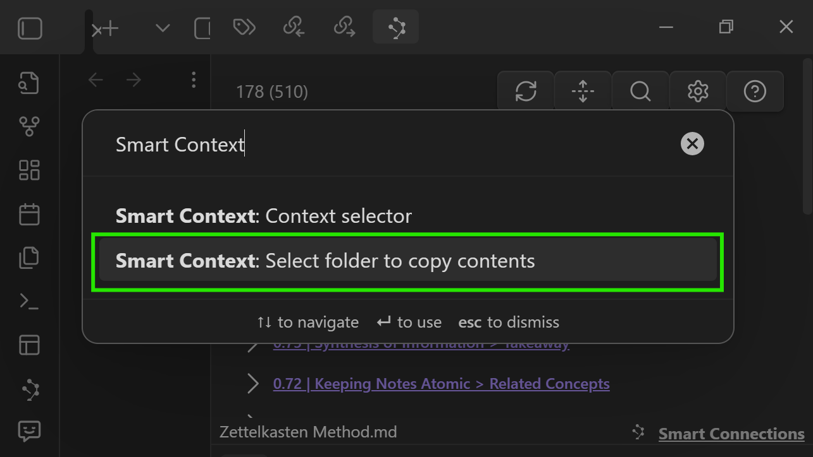

Run **Select folder to copy contents** from the palette. A quick-filter modal lets you pick a folder in seconds.

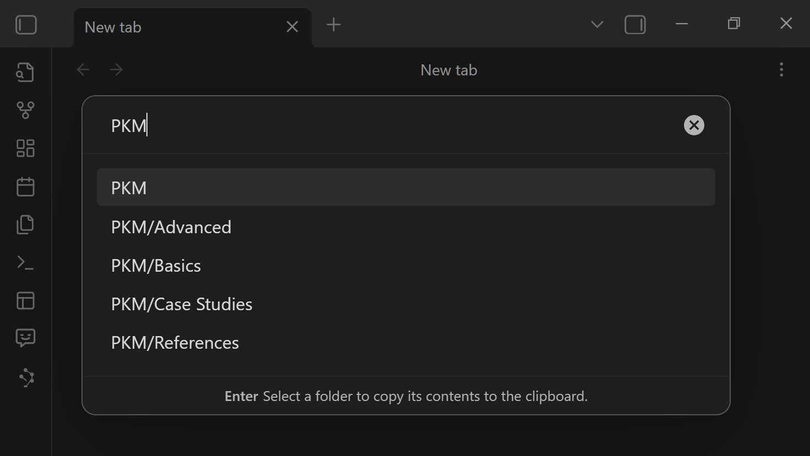

### Build a curated context set

Open the **Context selector** to mix individual notes, whole folders, AI-suggested connections, and links.

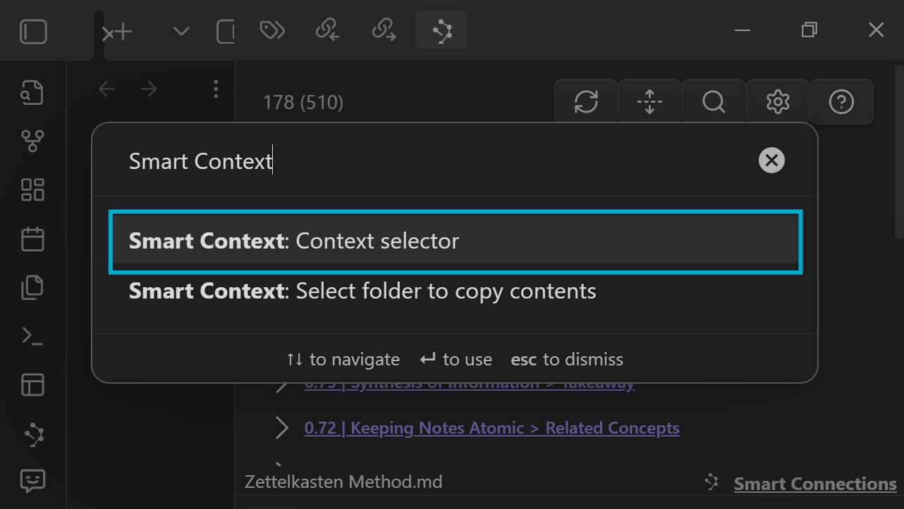

The selector UI lets you:

* **🟠 Visible Notes** – add every pane you can see
* **🔵 Open Notes** – capture all tabs, even hidden ones
* **🟢 Search Field** – filter thousands of notes instantly

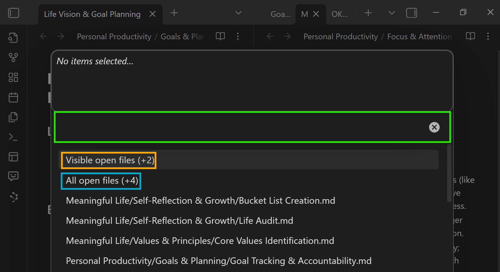

After selecting items:

* Add visible panes, open tabs, or search results
* Click the connection or link icons to discover related notes
* Remove items or clear the set before copying

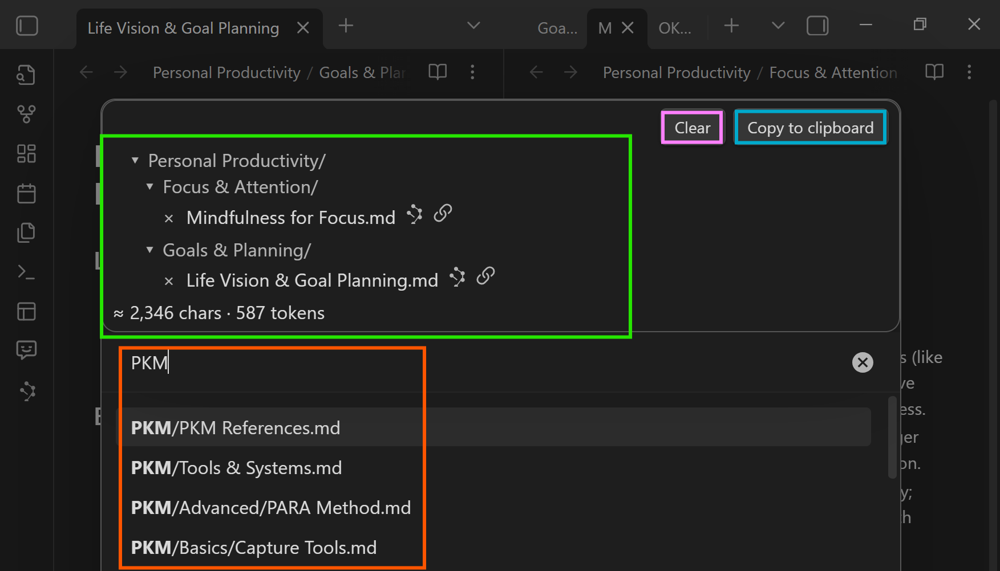

* **🟠 Type to add more**
* **🟢 Remove any item (×)**
* **🟣 Clear to start fresh**
* **🔵 Copy to clipboard**

Discover more with:

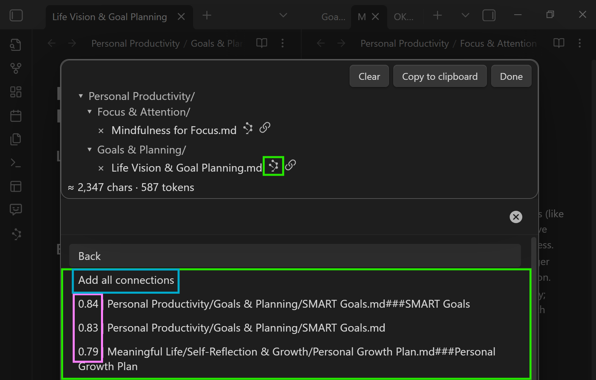
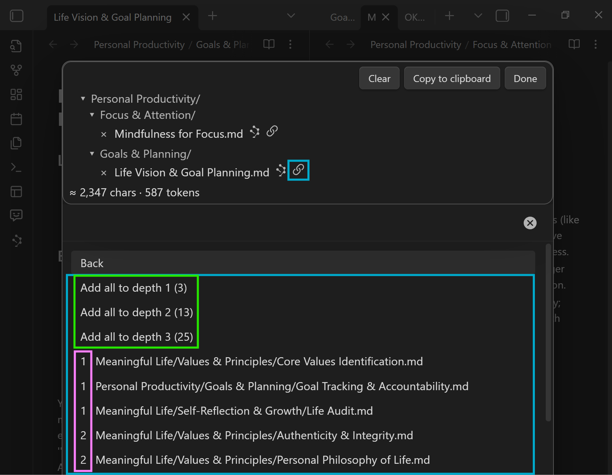

* Connections icon surfaces semantically related notes
* Link icon expands by link depth and shows path length

### One-click note exports

Need just the notes on screen? Use the toolbar or palette commands to copy current, visible, or all open notes.

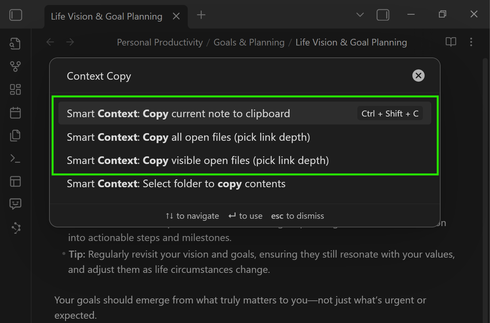

### Include linked notes automatically

When any copy command runs, pick a **link depth** to follow note links and pull in supporting material.

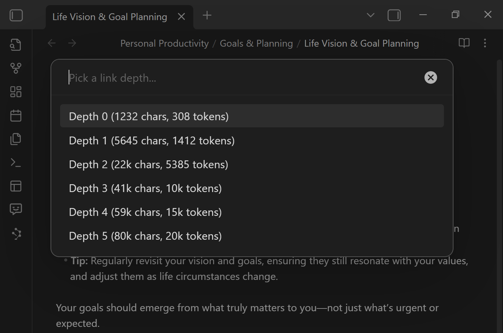

### Tailor the output

Smart Context ships with template-driven settings so you can style items, links, and entire prompts without code.

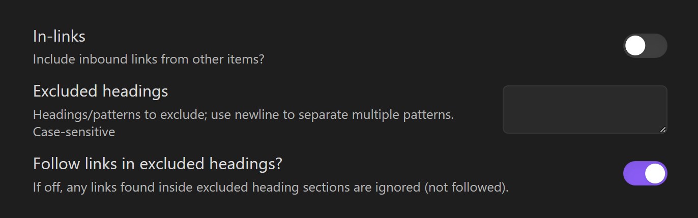
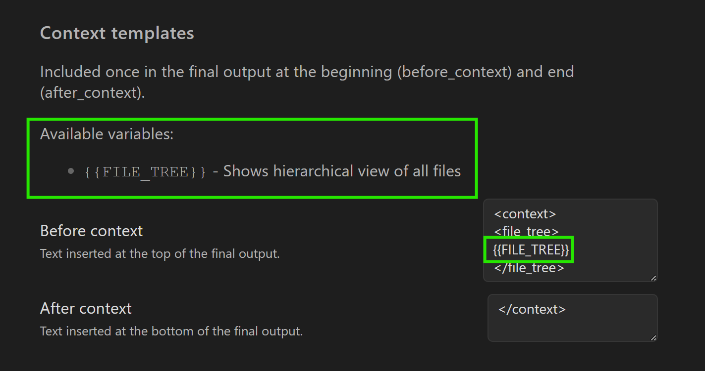

Explore **Settings -> Smart Context** to fine-tune exclusions, in-links, out-links, and template variables like `{{ITEM_PATH}}`, `{{ITEM_DEPTH}}`, and `{{ITEM_TIME_AGO}}`.

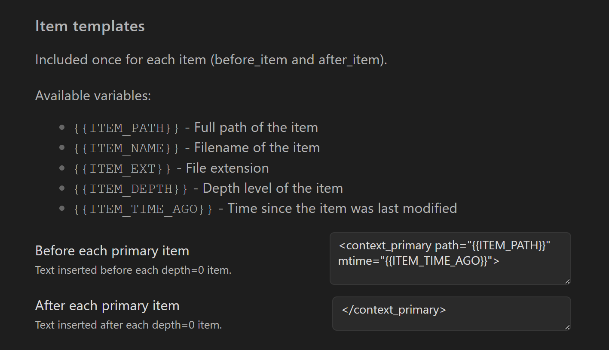
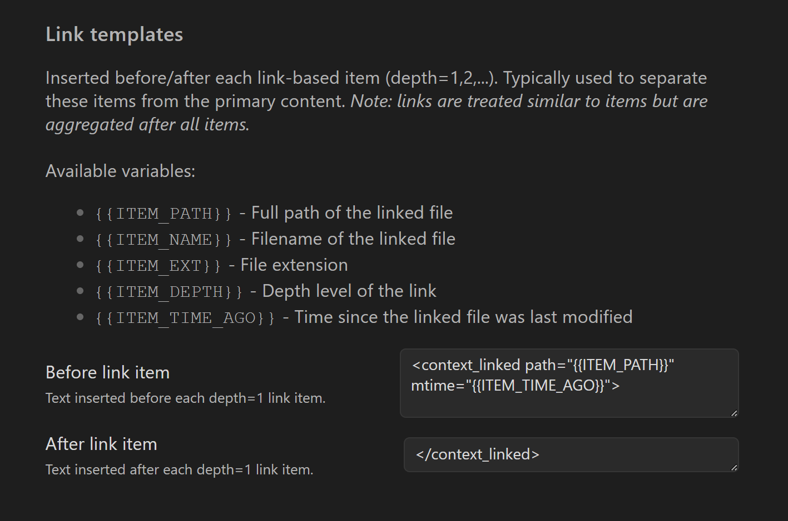

---

## Core Features

* **Copy folder contents**
 Grab every Markdown and Canvas file inside a folder—including sub-folders—and render a tree plus fenced code blocks.

* **Copy visible open files**
 Only the notes you can currently see are included. Perfect for quick Q&A sessions.

* **Copy all open files**
 Snapshot *every* tab—great for large refactors or brainstorming sessions.

* **Exclude headings**
 Add glob patterns (for example `*Secret*`, `Confidential`) and those sections vanish before copy.

* **Context builder UI**
 A modal lets you mix folders, individual notes, backlinks, outlinks, and AI-discovered connections into one curated bundle.

* **Token and character estimator**
 Live stats help you stay under model limits before you hit *Copy*.

* **Dataview content inclusion**
 Smart Context runs Dataview queries inside your notes, embeds rendered lists or tables in the copied context, and—when **link_depth > 0**—also follows any links discovered inside those results.

---

## Settings

* **Excluded Headings** – glob patterns to strip (no regex required)
* **In-links / Out-links** – include backlinks or only forward links
* **Before / After Context** – custom banners, file trees, or dividers
* **Before / After Each Item** – template strings like `{{ITEM_PATH}}` or `{{ITEM_DEPTH}}`

---

## Advanced Workflows

* **Context selector**
 Assign a hotkey, open the selector, and cherry-pick notes, folders, or AI-suggested connections without leaving the keyboard.

* **Smart Chat integration**
 Smart Context powers context in **Smart Chat**: drag items, build context, review before send.

---

## Smart Ecosystem

Smart Context is one puzzle piece alongside **Smart Connections** (semantic links), **Smart Chat** (context-aware chat), and **Smart Editor** (AI-assisted writing). Together they create your **Local Smart Environment**—no cloud lock-in, no monthly fees.

Join the [mission-driven community](https://smartconnections.app/community-supporters/?utm_source=context-readme).

---

## Thanks to the Community

Your feedback and support keep the project alive—thank you! 🌴
