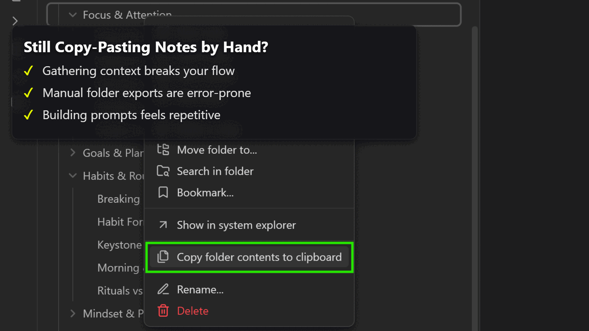

# Smart Context

**Feed large language models better inputs, faster.** **Smart Context *collects, cleans, and copies* every note you need** in a single click.

> [!NOTE] Why does context matter?
> AI only answers as well as the context you provide. Smart Context helps aggregate scattered notes into templated snippets that can be quickly pasted into ChatGPT, so your prompts hit harder, your responses feel clairvoyant, and your flow state stays unbroken.

✔️ Zero-setup: works out-of-the-box
🔐 Local-first and privacy-preserving
🤖 Compatible with any AI workflow
⚔️ Mission-driven, community-supported

---

---

## Mission-driven

The Obsidian community proved user-aligned software can out-innovate closed platforms. Smart Context embodies that spirit—open-source tools that **empower individuals**, not gatekeepers. Read about the [Smart Principles](https://smartconnections.app/smart-principles/) that guide development.

## Private by Design

No data leaves your vault unless *you* copy it. All parsing, filtering, and token estimates run locally. Use local embedding models or remote APIs—it is your choice.

---

## Getting started

Read the [Getting Started guide](./GETTING_STARTED.md) for a step-by-step walkthrough.

---

## Smart Ecosystem

Smart Context is one puzzle piece alongside **Smart Connections** (semantic links), **Smart Chat** (context-aware chat), and **Smart Editor** (AI-assisted writing). Together they create your **Local Smart Environment**—no cloud lock-in, no monthly fees.

Join the [mission-driven community](https://smartconnections.app/community-supporters/?utm_source=context-readme).

## FAQs
> [!INFO] 

Does it work on mobile
Yes, the Core Smart Context plugin is mobile friendly. **Context Pro**: some features are not compatible with mobile.

## Thanks to the Community

Your feedback and support keep the project alive—thank you! 🌴
