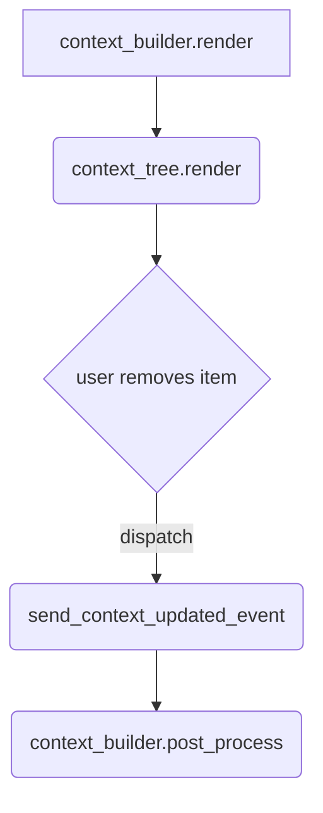

# Components

## context_tree
Interactive tree view for current SmartContext items.
- Collapsible directories, click to open notes.
- Emits `smart-env:context-updated` events when items change.
- Shows image thumbnails for image files.

### Functions
- `build_html(ctx): string`
- `render(ctx, opts?): Promise<HTMLElement>`
- `post_process(ctx, container, opts?): Promise<void>`
- `toggle_collapsed(li): void`
- `setup_collapse_handlers(container): void`

## context_stats
Displays estimated character and token counts for selected items.

## copy_to_clipboard_button
Button that copies given markdown to clipboard when clicked.

### Functions
- `build_html(): string`
- `render(ctx): Promise<DocumentFragment>`

## context_builder
Renders tree and stats together with footer actions.

### Functions
- `build_html(ctx, opts?): string`
- `render(ctx, opts?): Promise<HTMLElement>`
- `post_process(ctx, container, opts?): Promise<void>`

### Flow

